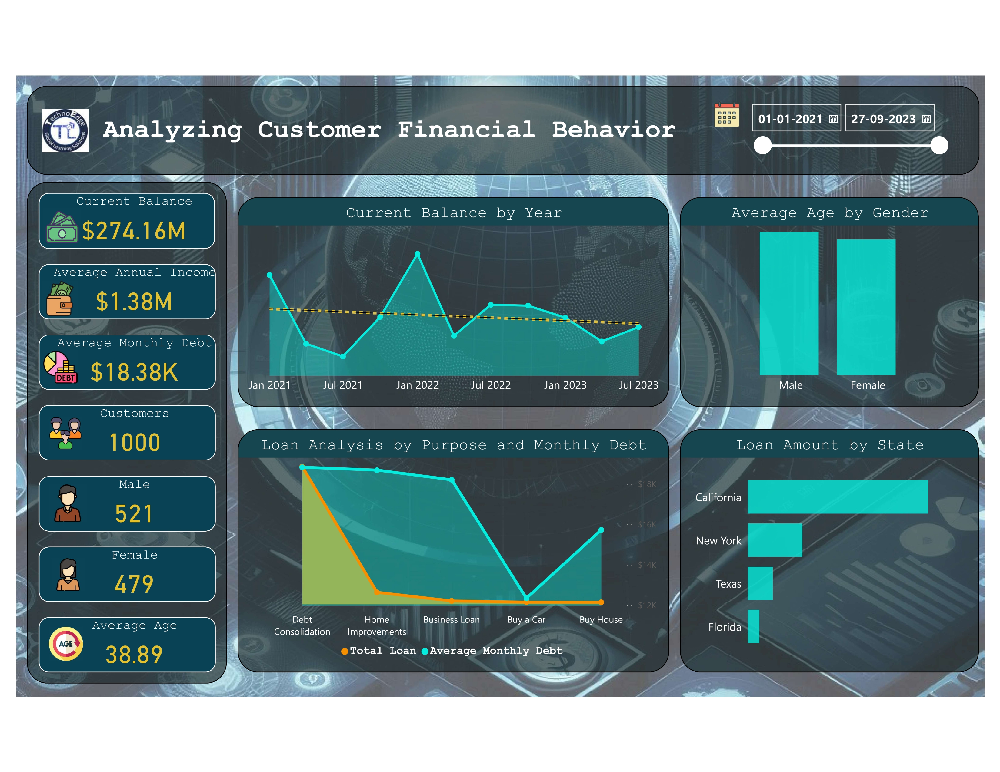

# Bank Domain I

## Overview
TechnoEdge Banking Dashboard provides insights into customer demographics, loan details, and time-based trends. Using interactive visuals in Power BI, stakeholders can analyze key metrics such as loan status, credit balances, and customer income distribution for data-driven decision-making.

## Problem Statement
Banks require better visibility into loan performance, customer demographics, and financial trends to optimize lending strategies. Manual tracking in spreadsheets makes it difficult to extract actionable insights efficiently.

## Solution
This Power BI report provides an interactive dashboard for tracking customer demographics, loan distribution, and financial trends, allowing banking professionals to make informed lending and risk assessment decisions.

### Key Objectives
1. Analyze loan status distribution using visualizations.
2. Compare average annual income by gender.
3. Visualize trends in monthly debt over time.
4. Display total current credit balance in an interactive card visual.
5. Filter data by calendar quarter using slicers for focused analysis.
6. Implement a bookmark navigator for seamless report navigation.

## Project Summary
This Power BI dashboard integrates customer and loan details from multiple sources to provide deep insights into loan trends, customer income distribution, and financial performance. The interactive visualizations help banks optimize risk assessment and lending decisions.

## 🔗 Power BI Report Link (Live Dashboard)
[Click here to view the report](https://app.powerbi.com/view?r=eyJrIjoiNGQxMjIwMzAtNTk1OS00NDc2LWI4M2YtZmY0OTIwZGI5MGZmIiwidCI6ImM2ZTU0OWIzLTVmNDUtNDAzMi1hYWU5LWQ0MjQ0ZGM1YjJjNCJ9)

## Report Preview

