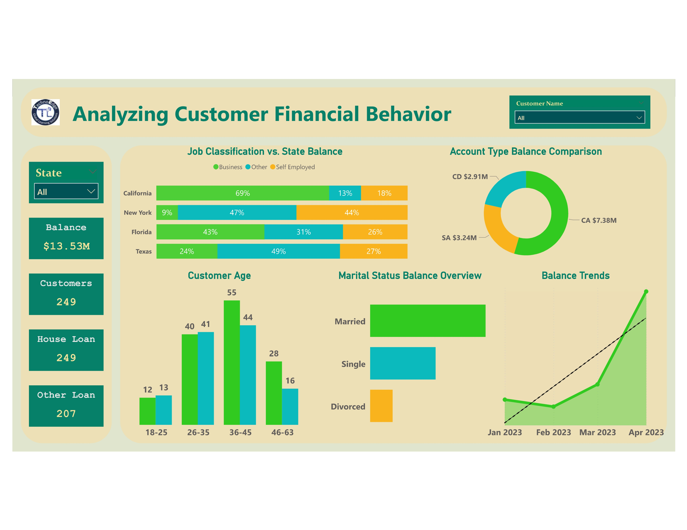

# Bank Domain II

## Overview  
Explore the **TechnoEdge banking dataset**, which includes customer demographics, account details, and loan information. This interactive Power BI report helps in analyzing key metrics such as customer age, gender, job classification, balance, and loan details for better decision-making.  

## Power BI Report Link (Live Dashboard)
[Click here to view the report](https://app.powerbi.com/view?r=eyJrIjoiZTJhZjg2MGYtMGEyNC00N2Q0LTk4YTItN2NkMWM1Nzg5MjZhIiwidCI6ImM2ZTU0OWIzLTVmNDUtNDAzMi1hYWU5LWQ0MjQ0ZGM1YjJjNCJ9)

## Report Preview  
  

## Problem Statement  
TechnoEdge needs a **comprehensive banking analytics solution** to understand customer demographics, account balances, and loan distributions. Without proper insights, the company struggles to identify trends and make data-driven financial decisions.  

## Solution  
A **Power BI dashboard** that enables:  
- **Customer segmentation** based on demographics  
- **Comparison of balances** between male and female customers  
- **Analysis of loan patterns** by job classification and marital status  
- **Identification of top-performing regions** in terms of banking customers  
- **Trend analysis** of account balance over customer tenure  

## Objectives  
1. Analyze the **age distribution** of TechnoEdge banking customers.  
2. Compare the **average account balance** between male and female customers.  
3. Identify the **top three states** with the highest number of customers.  
4. Explore the **correlation between job classification and loan types**.  
5. Compare **housing loan distribution** between married and unmarried customers.  
6. Determine the **most common account type** among customers.  
7. Analyze the **relationship between account tenure and balance trends**.  
8. Identify the **top three countries** with the highest number of customers.  
