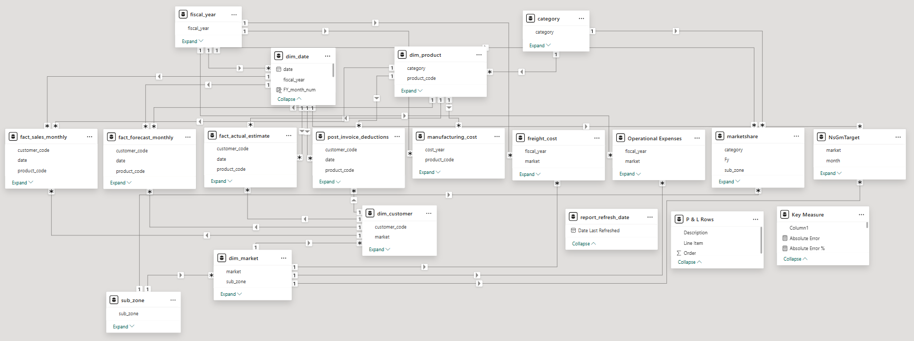
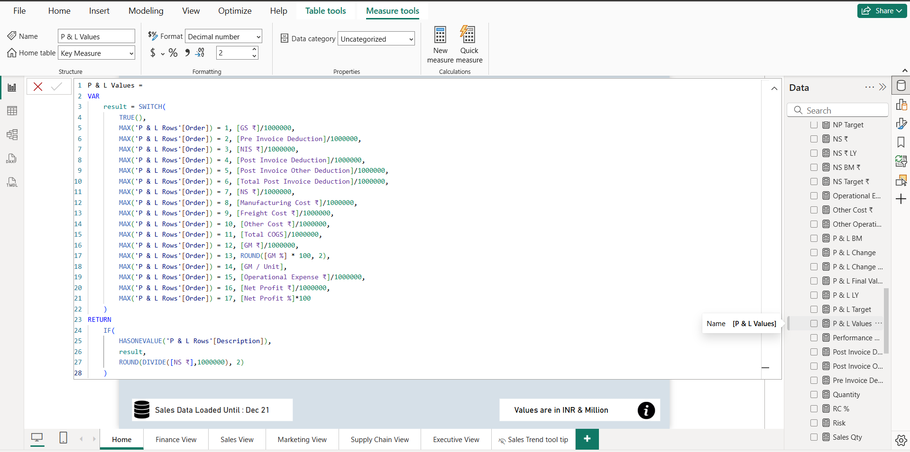
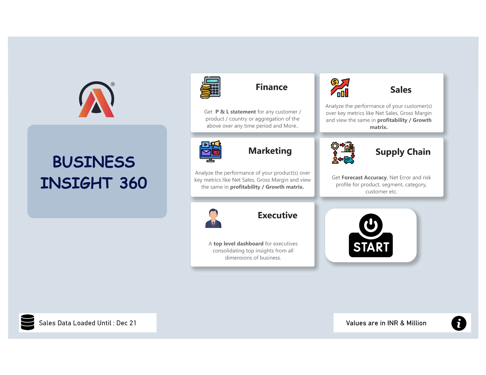
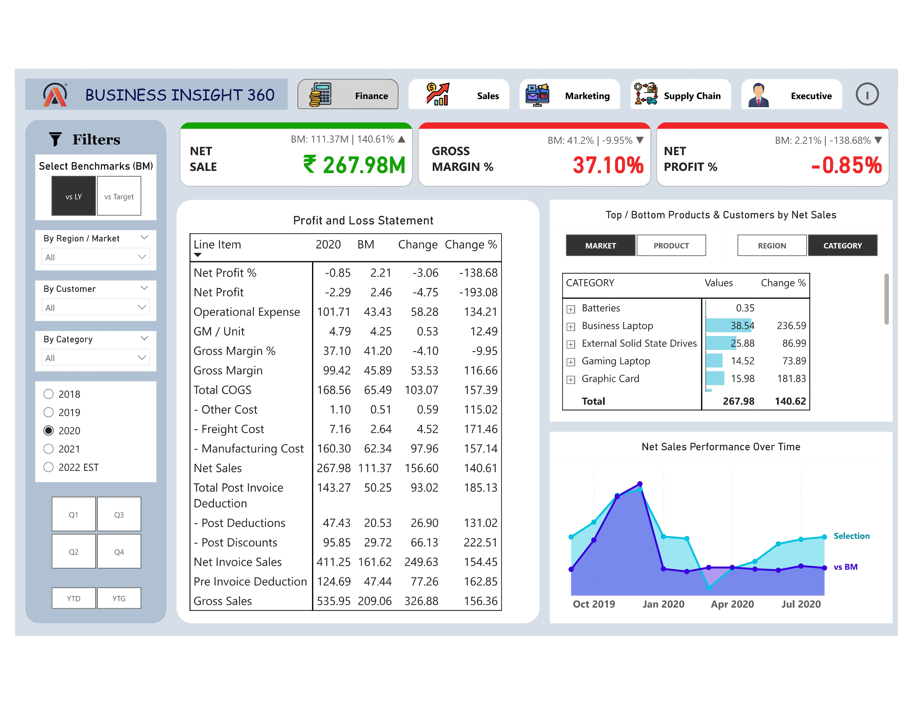

# Business Insight 360 🚀

## 📊 Overview
**Title:** Business Insights 360 for Finance, Sales, Marketing, Supply Chain, and Executive Teams

**Problem Statement:**  
AtliQ Hardwares, a rapidly expanding consumer electronics company, struggles to compete with data-driven businesses as most of their reports are still in Excel. This results in inefficient decision-making, lack of real-time insights, and difficulty in tracking key business metrics.

**Solution:**  
This project implements an advanced analytics solution using Power BI, consolidating data from multiple sources into a single, interactive dashboard. This enables stakeholders to gain actionable insights, identify trends, and make data-driven decisions efficiently.

## 🔍 Project Description
This report serves as a unified solution for stakeholders across sales, marketing, finance, and executive teams. Key focus areas include:

1. **Robust Data Modeling** - Efficient structuring and relationships across 10+ tables.
2. **User-Centric Report Design** - Ensuring usability and clarity for different stakeholders.
3. **Drillable Insights** - Enabling deep dives into key business metrics.

### 📚 Key Learnings
- Power Query (Basic & Advanced Operations)
- Complex DAX formulas for calculations
- Data modeling with multiple relationships
- Choosing effective visuals and formatting
- Dashboard design best practices
- Using bookmarks for seamless navigation
- Deployment in Power BI Service
- Implementing stakeholder feedback
- Sales, Marketing, Finance & Supply Chain KPIs

## 🛠️ Technical Implementation
- **Used MySQL Database** to load and retrieve the data.
- **Engineered a multi-view Power BI dashboard** for 5 departments (Sales, Finance, Supply Chain, Executive, and Marketing) to analyze global selling patterns at AtliQ Hardware.
- **Imported Data from 2 sources (MySQL & Excel)**, handling over 1 million records, constructing data models, and creating dynamic visualizations in Power BI.

## 🔗 Power BI Report Link
[Click here to view the report](https://app.powerbi.com/view?r=XXXXX)

## 📸 Report Preview 1
Data modelling involving 10+ tables

## 📸 Report Preview 2
DAX Measure

## 📸 Report Preview 3
Home Page

## 📸 Report Preview 4
Finance view

## 📸 Report Preview 5
DAX Measure

## 📸 Report Preview 6
DAX Measure

## 📸 Report Preview 7
DAX Measure

## 📸 Report Preview 8
DAX Measure

