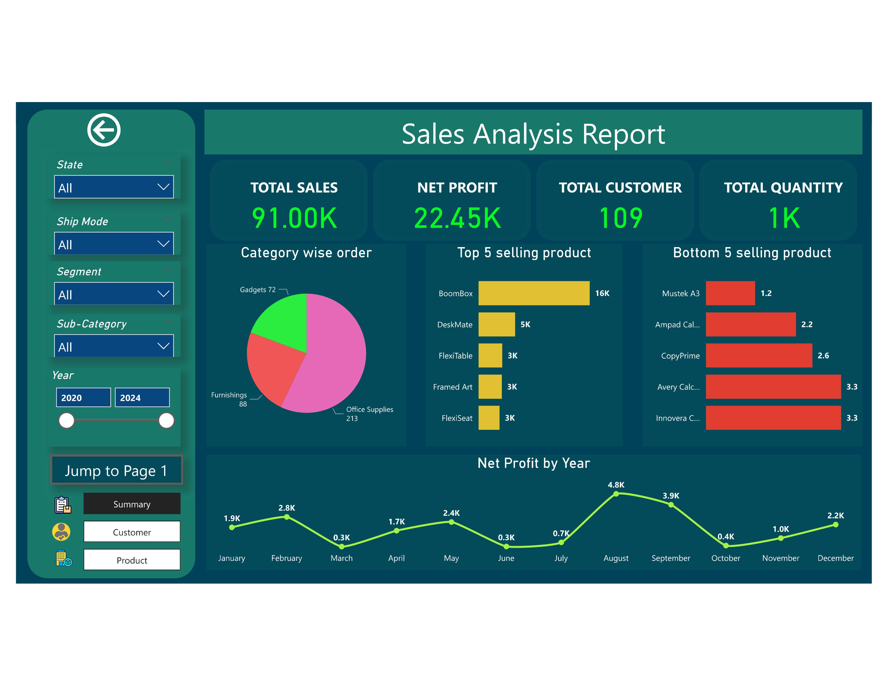
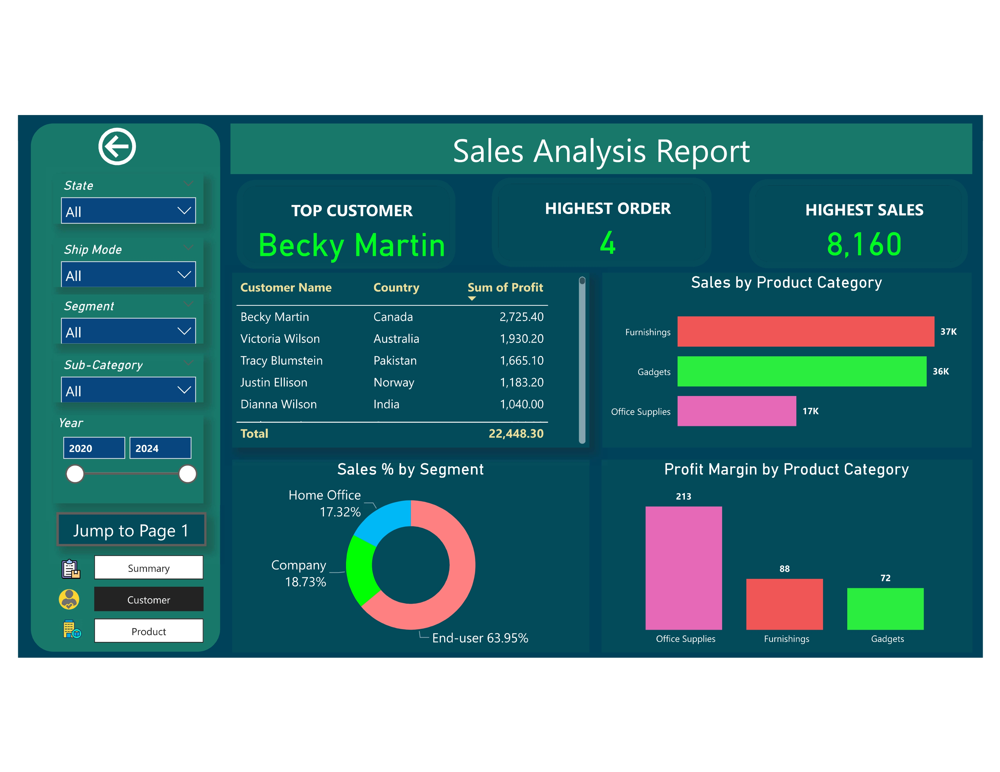
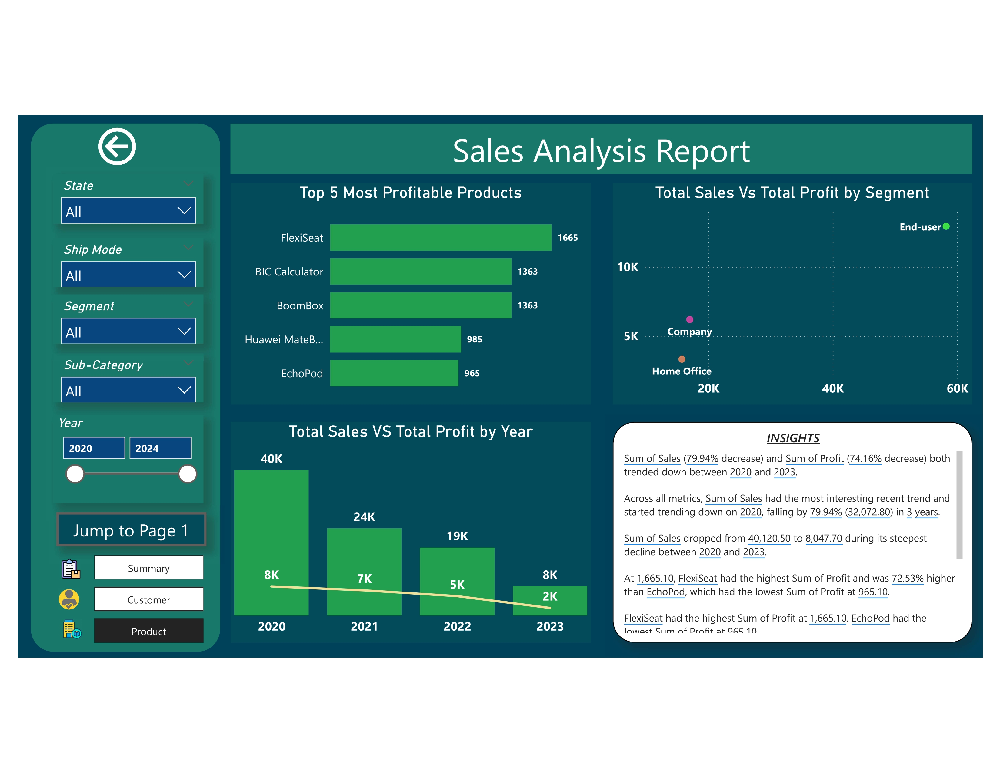

# FMCG Sales Analysis Report 

## Overview
**Title:** FMCG Sales Analysis for TechnoEdge

**Project Summary:**  
TechnoEdge, a diversified FMCG company, faced challenges in understanding sales trends across regions and product categories. This project leverages Power BI to uncover insights, optimize sales strategies, and drive business growth.

## Problem Statement
TechnoEdge struggled with fragmented sales data, making it difficult to:
- Identify high and low-performing products.
- Understand customer behavior and buying patterns.
- Analyze sales trends across different regions.
- Optimize pricing, discount strategies, and inventory management.

## Solution ✅
A comprehensive Power BI report was developed to provide:
- **Sales Performance Insights** – Tracking revenue, profit, and profit margins.
- **Customer Analysis** – Understanding retention, lifetime value, and purchase behavior.
- **Product Analysis** – Identifying best-selling and underperforming products.
- **Region-Wise Breakdown** – Analyzing sales trends across locations.
- **Interactive Dashboards** – Allowing stakeholders to drill down and gain meaningful insights.

## Objectives 
1. Analyze sales data across regions, countries, and product categories.
2. Identify trends and patterns to improve business performance.
3. Understand customer preferences based on purchasing behavior.
4. Recognize high and low-performing products and categories.
5. Monitor key sales metrics and identify areas for improvement.
6. Develop interactive visualizations to support strategic decision-making.

## 🛠️ Key Learnings & Tools Used
- **Data Visualization & Analysis Concepts**
- **Power BI Tools:** Power Query, Power Pivot, Power View
- **Data Modeling & ETL Processes**
- **Collaboration with Stakeholders**
- **Sales & Marketing Analytics**

## 🔗 Power BI Report Link (Live Dashboard)
[Click here to view the report](https://app.powerbi.com/view?r=eyJrIjoiOGEyYmM5ZTAtMmYzMS00YzcyLWJkZGYtNzc5OGM4Nzk5NGY0IiwidCI6ImM2ZTU0OWIzLTVmNDUtNDAzMi1hYWU5LWQ0MjQ0ZGM1YjJjNCJ9)

## 📸 Report Preview 1: Summary

## 📸 Report Preview 2: Customer

## 📸 Report Preview 3: Product

