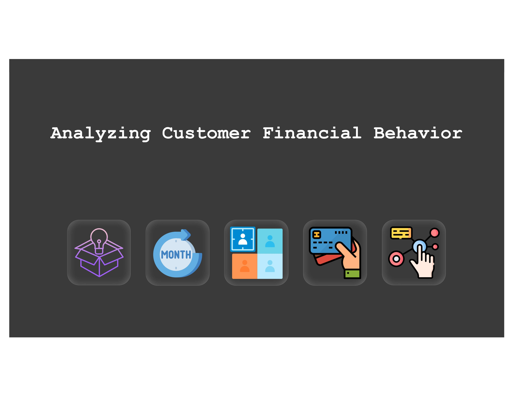
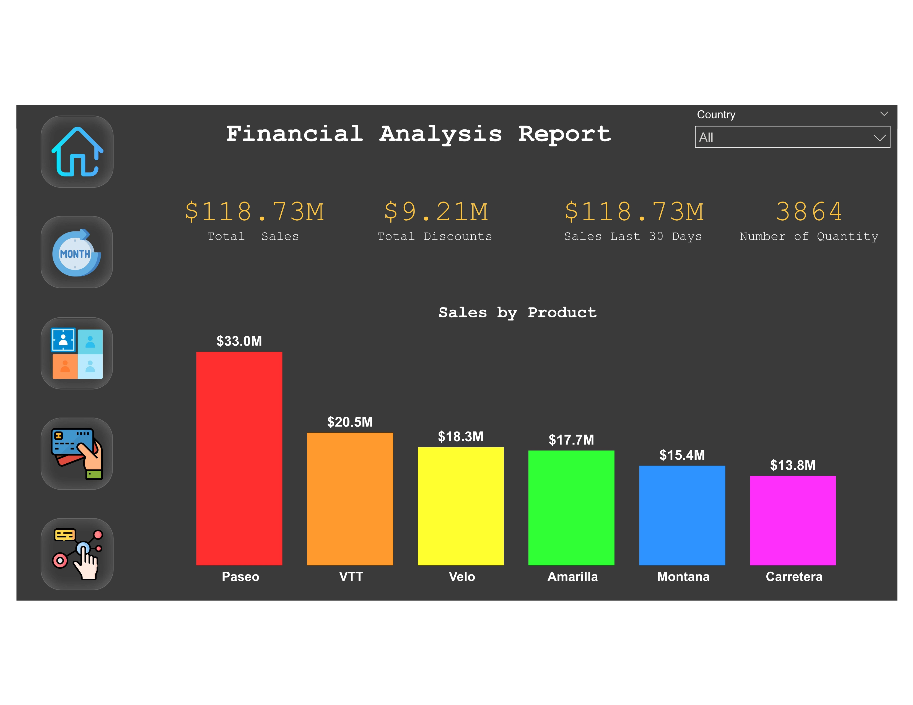
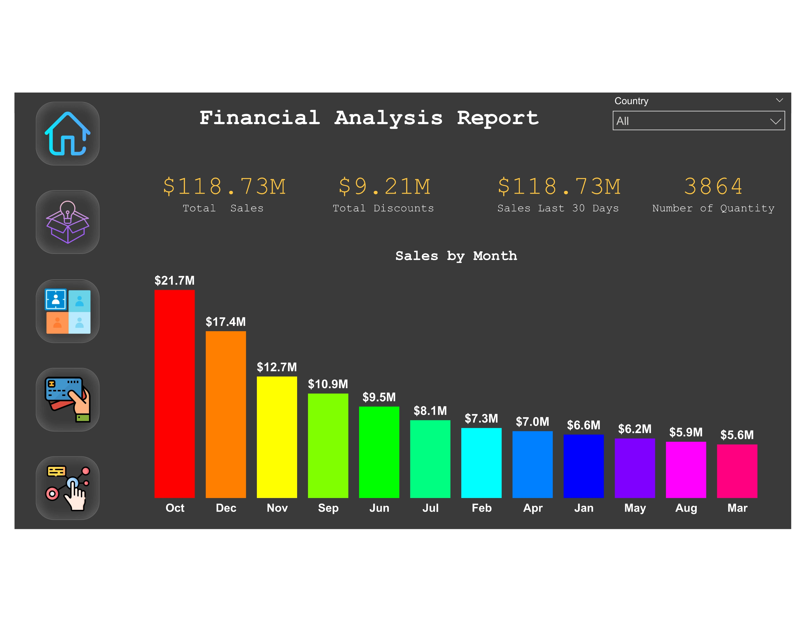
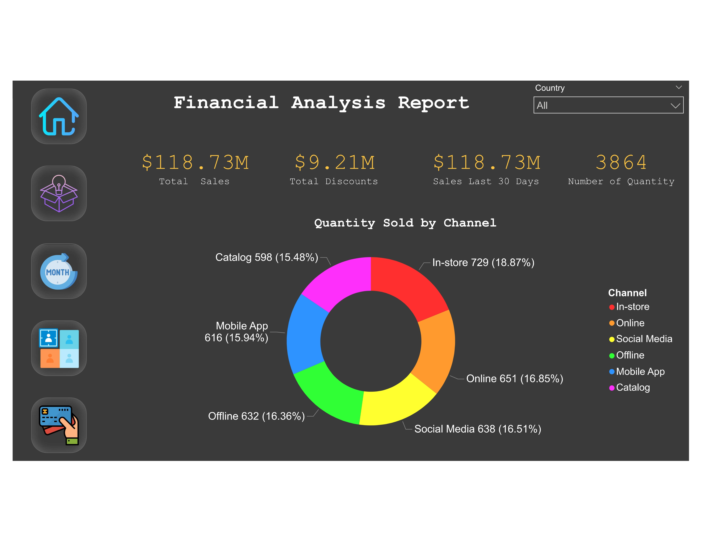

# Finance Domain II 💰

## 📊 Overview
TechnoEdge's Power BI project provides an interactive snapshot of financial data, including sales, profit, and transaction details. Visuals such as bar charts and tables display key metrics by segments, products, and countries, allowing for easy analysis and decision-making.

## ❌ Problem Statement
TechnoEdge faces challenges in analyzing its financial data effectively. Key financial metrics such as sales, profits, and transactions are scattered across multiple datasets, making it difficult for decision-makers to derive meaningful insights. A lack of a centralized reporting system leads to inefficiencies in tracking financial performance.

## ✅ Solution
This Power BI solution consolidates TechnoEdge's financial data into an interactive dashboard. It enables stakeholders to track sales, profit trends, and transactions in real-time, making data-driven decisions easier. 

## 🎯 Objectives
1. **Sales Analysis** - Interactive report for sales performance by segment, country, product, and discount band with line charts and filters.
2. **Transaction Analysis** - Report for transaction trends by date, quantity, payment method, and channel with line charts and slicers.
3. **Profitability Analysis** - Report for profitability metrics with bullet charts, comparing actual vs. target profit margins.
4. **Sales Channel Analysis** - Report for sales performance by online/offline channels with stacked area charts and drill-through.
5. **Customer Analysis** - Report for customer demographics, payment methods, and purchasing patterns with pie charts and filters.
6. **Financial Performance Analysis** - Report for financial metrics by month, quarter, and year with line charts, KPIs, and interactive features.

## 🔍 Project Summary
TechnoEdge's finance data includes three key tables: **Finance Sales Data, Finance Transactions, and Finance Calendar**. These datasets are used to build an interactive Power BI report that visualizes essential financial metrics. The dashboard enables stakeholders to track sales, profits, customer behaviors, and payment trends across different segments, products, countries, and channels.

## 🔗 Power BI Report Link
[Click here to view the report](https://app.powerbi.com/view?r=eyJrIjoiOTQ3NTIxNjctOTk4ZS00ZDc4LWFjM2UtYWIwNGFkZDYyY2RkIiwidCI6ImM2ZTU0OWIzLTVmNDUtNDAzMi1hYWU5LWQ0MjQ0ZGM1YjJjNCJ9)

## 📸 Report Preview 1

## 📸 Report Preview 2

## 📸 Report Preview 3

## 📸 Report Preview 4

## 📸 Report Preview 5

## 📸 Report Preview 6

