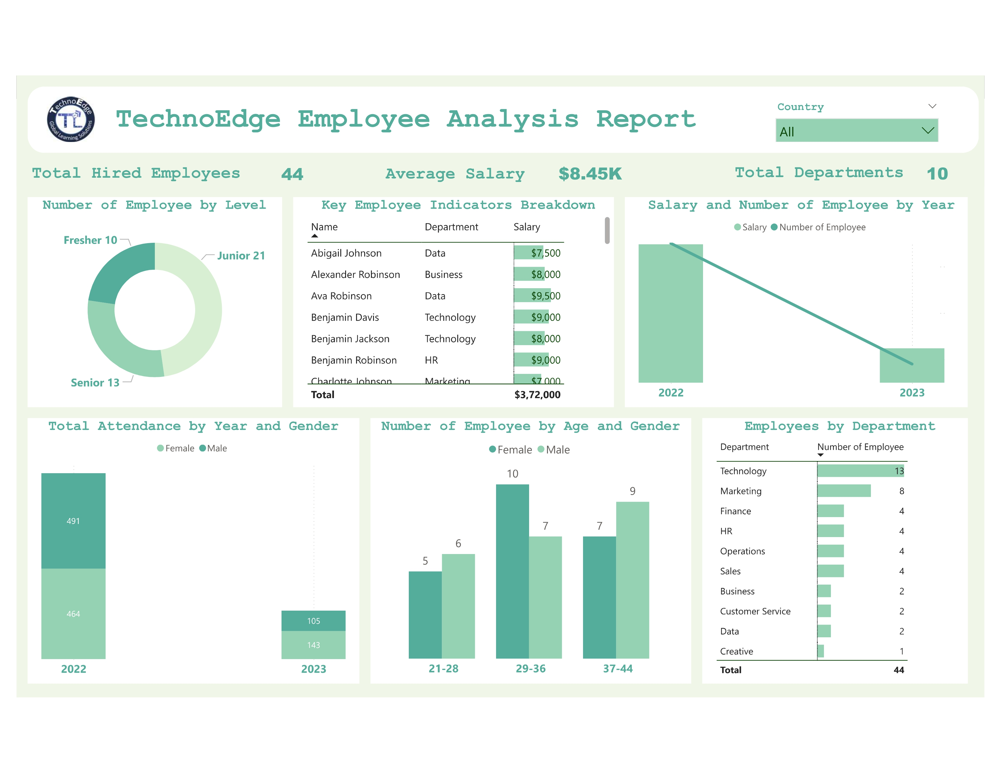

# HR Domain

## Overview  
The **TechnoEdge Employee Details dataset** contains information on employee **ID, name, position, salary, attendance, and demographics**. This Power BI report provides **insights into workforce trends, performance, and overall productivity**.  

## Report Preview  
  

## Power BI Report Link (Live Dashboard)
[Click here to view the report](https://app.powerbi.com/view?r=eyJrIjoiMGQyZTY5MWItZWFmNS00NjhmLWIyMmYtMjQ4ZjM2YTQyNGY3IiwidCI6ImM2ZTU0OWIzLTVmNDUtNDAzMi1hYWU5LWQ0MjQ0ZGM1YjJjNCJ9)

## Problem Statement  
TechnoEdge struggles with **understanding workforce efficiency, attendance trends, employee turnover, and salary distribution**. Without proper analytics, identifying key workforce trends and making informed HR decisions becomes challenging.  

## Gap  
- **Lack of visibility** into attendance and performance metrics.  
- **No clear insights** on employee skills, experience, and department-wise distribution.  
- **Limited understanding** of employee retention and turnover trends.  

## Solution  
A **Power BI dashboard** that provides:  
- **Attendance analysis** to track employee presence.  
- **Employee qualifications and skills** visualization.  
- **Department-wise gender distribution** for diversity insights.  
- **Experience and salary trends** to identify pay gaps.  

## Objectives  
1️⃣ **Analyze attendance patterns** for workforce efficiency.  
2️⃣ Display **education qualifications and skills** for employee development.  
3️⃣ **Count employees by age and gender** using bar charts.  
4️⃣ Understand **employee experience and salary distribution**.  
5️⃣ Investigate **age and nationality** trends.  
6️⃣ Monitor **employee performance by position** using tables.  
7️⃣ Identify **employee emergency contacts** for quick access.  
