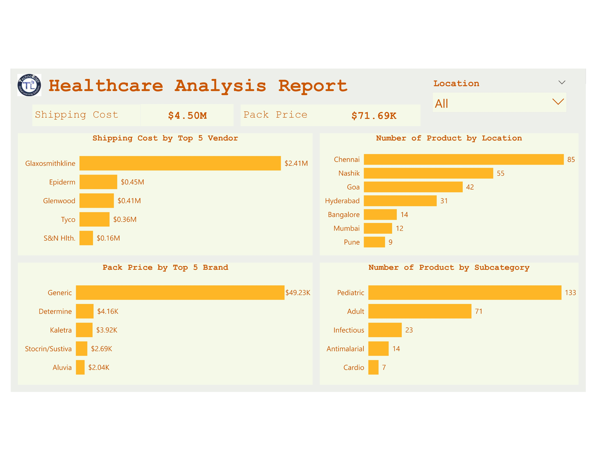

# Healthcare Domain 🏥  

## 📊 Overview  
The **TechnoEdge Healthcare Product Pricing dataset** contains details on **product ID, vendor, brand name, unit price, dosage form, and manufacturer location**. This Power BI report provides **insights into pricing trends, vendor selection, and product development** through interactive analysis.  

## 🔍 Problem Statement  
TechnoEdge lacks **visibility into pricing trends, vendor performance, and product demand** across different healthcare categories. Without clear insights, optimizing pricing strategies and improving vendor selection remains a challenge.  

## ⚠️ Gap  
- **No centralized view** of pricing patterns across product groups.  
- **Lack of insights** on vendor and manufacturer performance.  
- **Unclear impact** of discounts and packaging on sales.  
- **Limited understanding** of geographic price variations.  

## ✅ Solution  
A **Power BI dashboard** that provides:  
- **Pricing analysis** across sub-categories and product groups.  
- **Top vendors and manufacturers by sales** to aid supplier decisions.  
- **Comparison of dosage forms and their pricing** for better product selection.  
- **Impact of weight on shipping and insurance costs** for logistics optimization.  
- **Effectiveness of discounts on sales trends** to refine pricing strategies.  
- **Geographic pricing trends** for better market positioning.  

## 🎯 Objectives  
1️⃣ **Analyze pricing trends** across product groups.  
2️⃣ Identify **top vendors and manufacturers** based on sales.  
3️⃣ Determine **top-selling molecules/test types and their prices**.  
4️⃣ Compare **prices of different dosage forms** of the same product.  
5️⃣ **Analyze the impact of weight** on shipping and insurance costs.  
6️⃣ Evaluate **the effectiveness of discounts on sales**.  
7️⃣ Identify **geographic pricing trends**.  
8️⃣ **Analyze the relationship between sales and packaging**.  

## 🔗 Power BI Report Link (Live Dashboard)  
[Click here to view the report](https://app.powerbi.com/view?r=eyJrIjoiMWJkNGJlYzAtMDFjNy00YjdmLWFiYTYtZmE3N2Q1MGQyNTdjIiwidCI6ImM2ZTU0OWIzLTVmNDUtNDAzMi1hYWU5LWQ0MjQ0ZGM1YjJjNCJ9)

## 📸 Report Preview  
  
