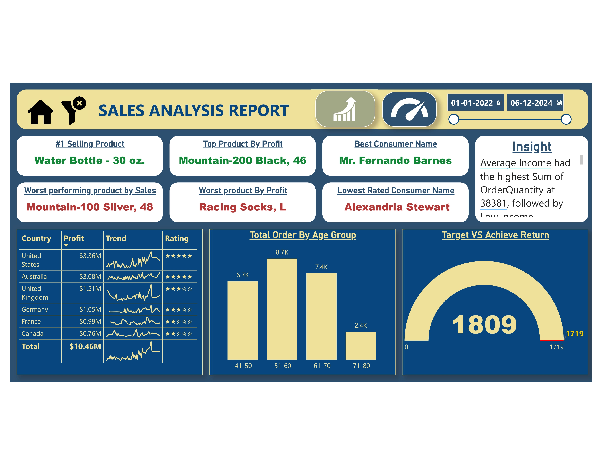
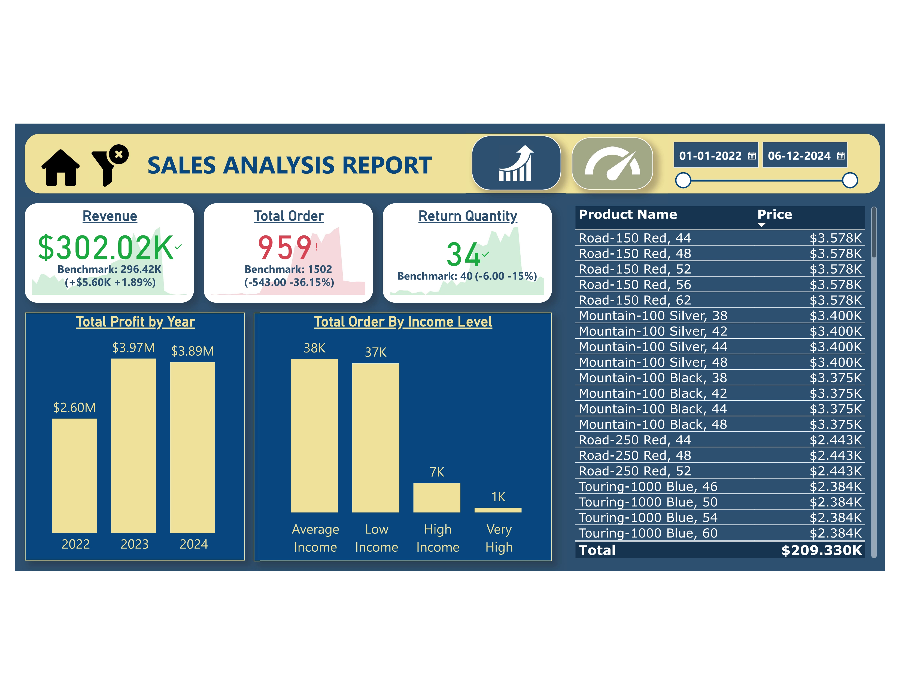

# Sales Analysis Report 📊

## 🔍 Overview  
TechnoEdge aims to optimize its sales and customer engagement by analyzing sales data from 2022 to 2024. The dataset includes details on customers, products, territories, returns, and sales transactions. This report leverages Power BI to provide interactive visualizations and insights into sales trends, customer behavior, and product performance.

## 🚨 Problem Statement  
TechnoEdge lacks data-driven decision-making capabilities, leading to inefficiencies in sales performance, customer retention, and product management. Without a clear understanding of sales trends and customer preferences, the company struggles to maximize profitability and optimize marketing strategies.

## ✅ Solution  
By implementing Power BI, this project provides:
- **Interactive dashboards** to track sales trends, returns, and customer behavior.
- **Data-driven insights** to identify high-performing products and sales regions.
- **Performance monitoring** of key metrics like revenue, profit, and profit margins.
- **Actionable recommendations** for improving sales and marketing strategies.

## 🎯 Objectives  
1. Analyze sales data across different regions, countries, and product categories.  
2. Identify sales trends and patterns to enhance business performance.  
3. Understand customer behavior based on buying patterns.  
4. Identify high-performing and underperforming products.  
5. Track key sales metrics such as revenue, profit, and profit margin.  
6. Provide interactive reports for stakeholders to make data-driven decisions.  

## 🛠️ Key Features  
- **Advanced Data Modeling**: Relationships across multiple tables for better analysis.  
- **Power BI Visualizations**: Interactive charts and KPIs to monitor sales.  
- **DAX Formulas**: Custom calculations for sales forecasting and trend analysis.  
- **Data Integration**: Combined data from multiple sources for a holistic view.  

## 🔗 Power BI Report Link  
[Click here to view the report](https://app.powerbi.com/view?r=eyJrIjoiYzgzMGQwNmYtZTRjMS00ZmVmLWFhOTctNTNkNzBmOWVjYWE5IiwidCI6ImM2ZTU0OWIzLTVmNDUtNDAzMi1hYWU5LWQ0MjQ0ZGM1YjJjNCJ9)

## 📸 Report Preview 1

## 📸 Report Preview 2

